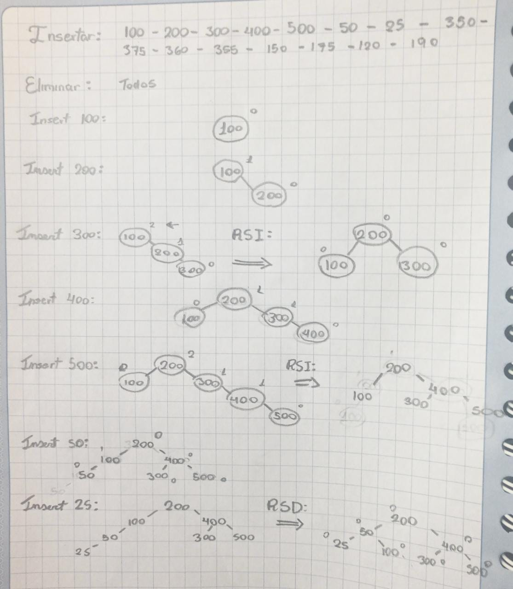
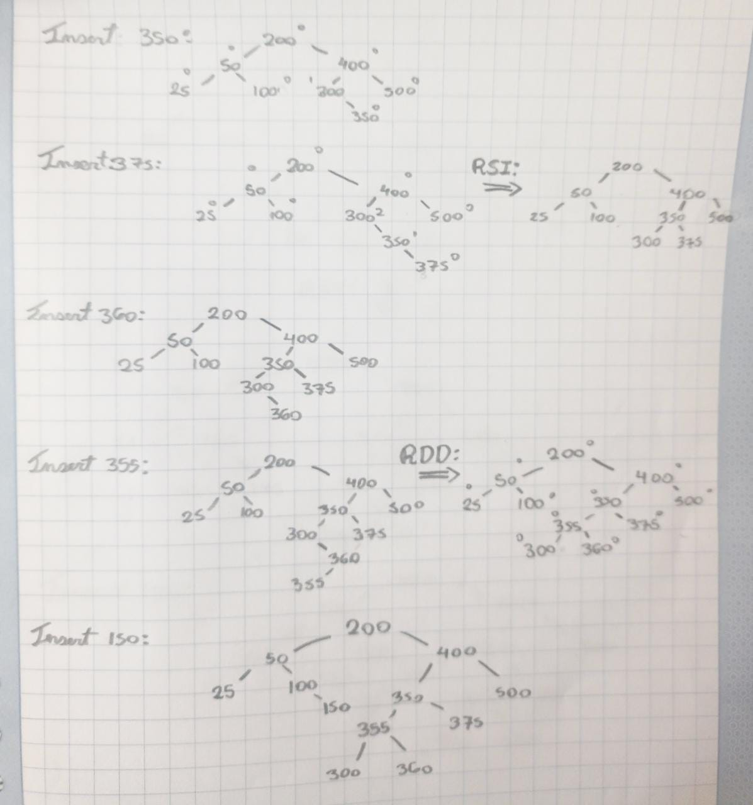
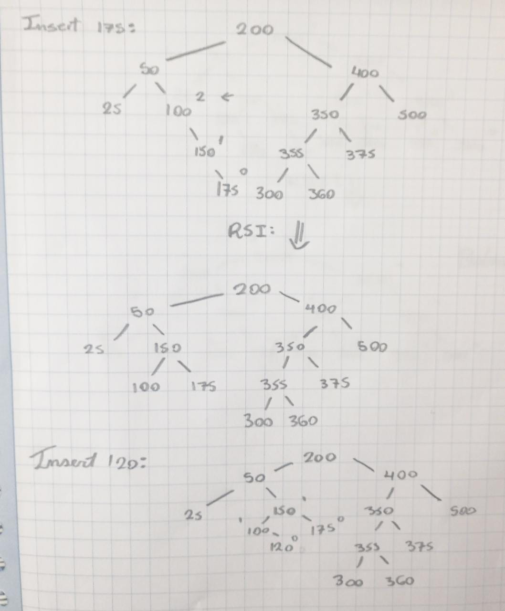
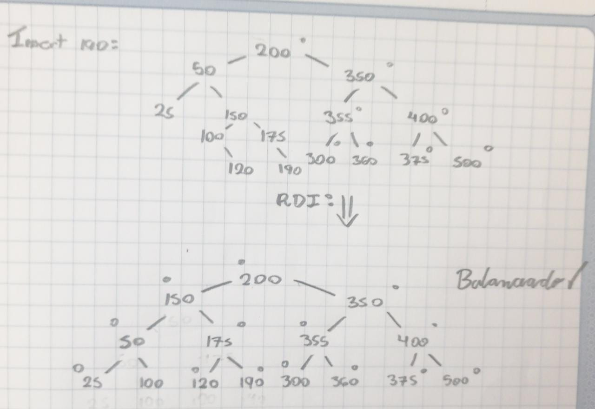

# EDA_Repositorio_Grupal_5
<html>
   <head>
      <meta content="text/html; charset=UTF-8" http-equiv="content-type">
   </head>
   <body class="c53">
      

         

         
         <table class="c34">
            <tr class="c59">
               <td class="c8" colspan="1" rowspan="1">
                  

               </td>
               <td class="c24" colspan="1" rowspan="1">
                  
UNIVERSIDAD NACIONAL DE SAN AGUSTIN

                  
FACULTAD DE INGENIER&Iacute;A DE PRODUCCI&Oacute;N Y SERVICIOS

                  
ESCUELA PROFESIONAL DE INGENIER&Iacute;A DE SISTEMA

               </td>
               <td class="c7" colspan="1" rowspan="1">
                  

               </td>
            </tr>
            <tr class="c13">
               <td class="c52" colspan="3" rowspan="1">
                  
Formato: Gu&iacute;a de Pr&aacute;ctica de Laboratorio / Talleres / Centros de Simulaci&oacute;n

               </td>
            </tr>
            <tr class="c46">
               <td class="c8" colspan="1" rowspan="1">
                  
Aprobaci&oacute;n: &nbsp;2022/03/01

               </td>
               <td class="c24" colspan="1" rowspan="1">
                  
C&oacute;digo: GUIA-PRLE-001

               </td>
               <td class="c7" colspan="1" rowspan="1">
                  
P&aacute;gina: 

               </td>
            </tr>
         </table>
         

      

      
INFORME DE LABORATORIO

      
(formato estudiante)

      
      <table class="c34">
         <tr class="c18">
            <td class="c25" colspan="6" rowspan="1">
               
INFORMACI&Oacute;N B&Aacute;SICA

            </td>
         </tr>
         <tr class="c10">
            <td class="c42" colspan="1" rowspan="1">
               
ASIGNATURA: 

            </td>
            <td class="c2" colspan="5" rowspan="1">
               
Laboratorio - Estructura de Datos y Algoritmos

            </td>
         </tr>
         <tr class="c10">
            <td class="c42" colspan="1" rowspan="1">
               
T&Iacute;TULO DE LA PR&Aacute;CTICA: 

            </td>
            <td class="c2" colspan="5" rowspan="1">
               
&Aacute;rboles

            </td>
         </tr>
         <tr class="c10">
            <td class="c42" colspan="1" rowspan="1">
               
N&Uacute;MERO DE PR&Aacute;CTICA:

            </td>
            <td class="c39" colspan="1" rowspan="1">
               
05

            </td>
            <td class="c43" colspan="1" rowspan="1">
               
A&Ntilde;O LECTIVO:

            </td>
            <td class="c21" colspan="1" rowspan="1">
               
2022 - A

            </td>
            <td class="c21" colspan="1" rowspan="1">
               
NRO. SEMESTRE:

            </td>
            <td class="c12" colspan="1" rowspan="1">
               
III

            </td>
         </tr>
         <tr class="c10">
            <td class="c42" colspan="1" rowspan="1">
               
FECHA DE PRESENTACI&Oacute;N

            </td>
            <td class="c39" colspan="1" rowspan="1">
               
29/06/2022

            </td>
            <td class="c43" colspan="1" rowspan="1">
               
HORA DE PRESENTACI&Oacute;N

            </td>
            <td class="c49" colspan="3" rowspan="1">
               

            </td>
         </tr>
         <tr class="c10">
            <td class="c28" colspan="4" rowspan="1">
               
INTEGRANTE (s): 

               <ul class="c0 lst-kix_list_1-0 start">
                  <li class="c22 c37 li-bullet-0">Garay Bedregal, C&eacute;sar Alejandro</li>
                  <li class="c22 c37 li-bullet-0">Chua Aguilar, Jean Carlo Leonel</li>
                  <li class="c22 c37 li-bullet-0">Cahuana Aguilar, Josu&eacute; Math&iacute;as Miguel</li>
                  <li class="c22 c37 li-bullet-0">Huisa Perez, Willy Alexander </li>
                  <li class="c22 c37 li-bullet-0">Arocutipa Gutierrez, Luis Edgar</li>
               </ul>
               

            </td>
            <td class="c21" colspan="1" rowspan="1">
               
NOTA:

            </td>
            <td class="c12" colspan="1" rowspan="1">
               

            </td>
         </tr>
         <tr class="c10">
            <td class="c50" colspan="6" rowspan="1">
               
DOCENTE(s):

               
Richart Smith Escobedo Quispe - rescobedoq@unsa.edu.pe

               

            </td>
         </tr>
      </table>
      

      
      <table class="c34">
         <tr class="c18">
            <td class="c25" colspan="1" rowspan="1">
               
SOLUCI&Oacute;N Y RESULTADOS

            </td>
         </tr>
         <tr class="c33">
            <td class="c6" colspan="1" rowspan="1">
               <ol class="c0 lst-kix_list_5-0 start" start="1">
                  <li class="c17 li-bullet-1">SOLUCI&Oacute;N DE EJERCICIOS/PROBLEMAS</li>
               </ol>
               <ol class="c0 lst-kix_gb8ko1xbmiz8-0 start" start="1">
                  <li class="c37 c54 li-bullet-0">Corchetes equilibrados</li>
               </ol>
               
(Luis aca pones tu parte)

               
Despu&eacute;s de haber definido las clases de pila, procedemos a ingresar el string para as&iacute; poder analizarlo y &nbsp; &nbsp; &nbsp; &nbsp; &nbsp; &nbsp; &nbsp; examinar si es que los corchetes est&aacute;n equilibrados, por medio de un for en el cual se obtienen los valores del string y as&iacute; determinar si est&aacute; equilibrado el string.

               

               <ol class="c0 lst-kix_gb8ko1xbmiz8-0" start="2">
                  <li class="c22 c37 li-bullet-0">Operaciones de &aacute;rbol AVL</li>
               </ol>
               
Las operaciones de inserci&oacute;n se realizaron a mano, graficando el paso a paso de cada rotaci&oacute;n y mostrando el &aacute;rbol con cada acci&oacute;n:

               

               

               

               

            </td>
         </tr>
         <tr class="c45">
            <td class="c6" colspan="1" rowspan="1">
               <ol class="c0 lst-kix_list_5-0" start="2">
                  <li class="c17 li-bullet-2">SOLUCI&Oacute;N DEL CUESTIONARIO</li>
               </ol>
               <ul class="c0 lst-kix_6x2vyb7zte6m-0 start">
                  <li class="c22 c37 li-bullet-0">No hay cuestionario</li>
               </ul>
               

            </td>
         </tr>
         <tr class="c45">
            <td class="c6" colspan="1" rowspan="1">
               <ol class="c0 lst-kix_list_5-0" start="3">
                  <li class="c17 li-bullet-1">CONCLUSIONES</li>
               </ol>
               <ul class="c0 lst-kix_list_2-0 start">
                  <li class="c22 c23 li-bullet-0"></li>
               </ul>
               

            </td>
         </tr>
      </table>
      

      
      <table class="c34">
         <tr class="c18">
            <td class="c25" colspan="1" rowspan="1">
               
RETROALIMENTACI&Oacute;N GENERAL

            </td>
         </tr>
         <tr class="c45">
            <td class="c6" colspan="1" rowspan="1">
               

               

            </td>
         </tr>
      </table>
      

      
      <table class="c34">
         <tr class="c18">
            <td class="c25" colspan="1" rowspan="1">
               
REFERENCIAS Y BIBLIOGRAF&Iacute;A

            </td>
         </tr>
         <tr class="c56">
            <td class="c6" colspan="1" rowspan="1">
               

            </td>
         </tr>
      </table>
      

      

   </body>
</html>